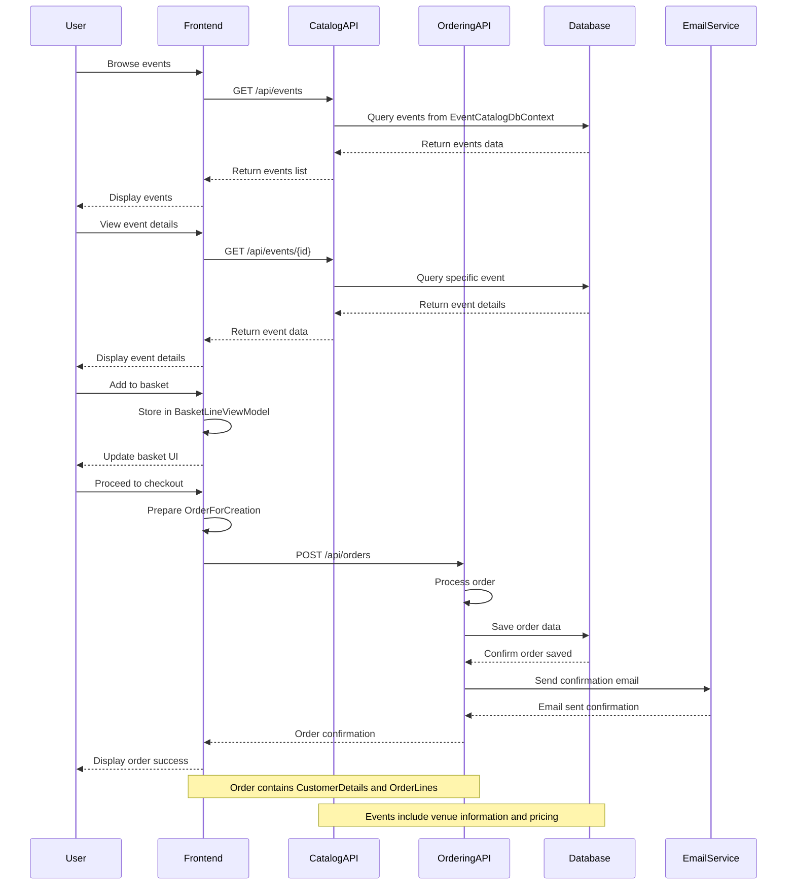

# GloboTicket Application - Data Flow Sequence Diagram

This diagram illustrates the data flow through the GloboTicket microservices application, showing how users interact with the system to browse events, manage their shopping basket, and complete orders.

## Application Flow Overview

The GloboTicket application consists of three main services:
- **Frontend Service**: ASP.NET Core MVC web application for user interaction
- **Catalog Service**: Web API for event and venue management
- **Ordering Service**: Web API for order processing and email notifications

## Sequence Diagram

## Key Data Flow Steps

### 1. Event Browsing
- Users request to view available events through the frontend
- Frontend calls the Catalog API to retrieve event data
- Catalog API queries the database using Entity Framework Core
- Event data (including venue information) is returned to the user

### 2. Event Details
- Users can view detailed information about specific events
- Similar flow to event browsing but for individual events
- Includes pricing, venue details, and availability information

### 3. Shopping Basket Management
- Items are stored locally in the frontend using `BasketLineViewModel`
- No backend calls required for basic basket operations
- Provides fast user experience for basket management

### 4. Order Processing
- When users proceed to checkout, an `OrderForCreation` object is prepared
- Frontend sends order data to the Ordering API
- Ordering service processes the order and saves it to the database
- Email confirmation is sent to the customer
- Success confirmation is returned to the frontend

## Technical Implementation Details

- **HTTP Communication**: Services communicate via HTTP REST APIs
- **Data Storage**: SQL Server database with Entity Framework Core
- **Service Discovery**: Configuration-based service endpoint resolution
- **Error Handling**: Try-catch blocks with fallback responses
- **Health Monitoring**: Built-in health checks and metrics collection

## Architecture Benefits

- **Scalability**: Each service can be scaled independently
- **Maintainability**: Clear separation of concerns between services
- **Resilience**: Services can continue operating if others are temporarily unavailable
- **Technology Flexibility**: Each service can use different technologies as needed
