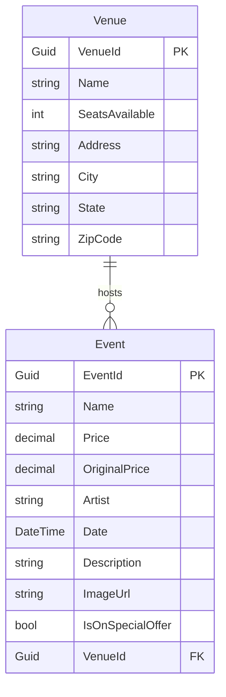

# GloboTicket Database Entity Relationship Diagram

This diagram shows the database entities and their relationships in the GloboTicket catalog system.

## Entity Descriptions

### Event Entity
- **EventId**: Primary key (GUID)
- **Name**: Event name/title
- **Price**: Current price (with possible discount)
- **OriginalPrice**: Original price before any discounts
- **Artist**: Performing artist name
- **Date**: Event date and time
- **Description**: Event description
- **ImageUrl**: Path to event image
- **IsOnSpecialOffer**: Flag indicating if event is on special offer
- **VenueId**: Foreign key linking to Venue

### Venue Entity
- **VenueId**: Primary key (GUID)
- **Name**: Venue name
- **SeatsAvailable**: Total number of available seats
- **Address**: Street address
- **City**: City name
- **State**: State/Province
- **ZipCode**: Postal/ZIP code

## Relationships

- **One-to-Many**: One Venue can host many Events
- **Foreign Key**: Event.VenueId references Venue.VenueId
- **Navigation Properties**: 
  - Event.Venue (virtual for lazy loading)
  - Venue.Events (virtual collection for lazy loading)

## Database Configuration Notes

- Both Price and OriginalPrice use decimal precision (10,2)
- Delete behavior is set to Restrict (prevents cascade deletes)
- Lazy loading is enabled via virtual navigation properties
- Uses Entity Framework Core with Proxies for lazy loading
